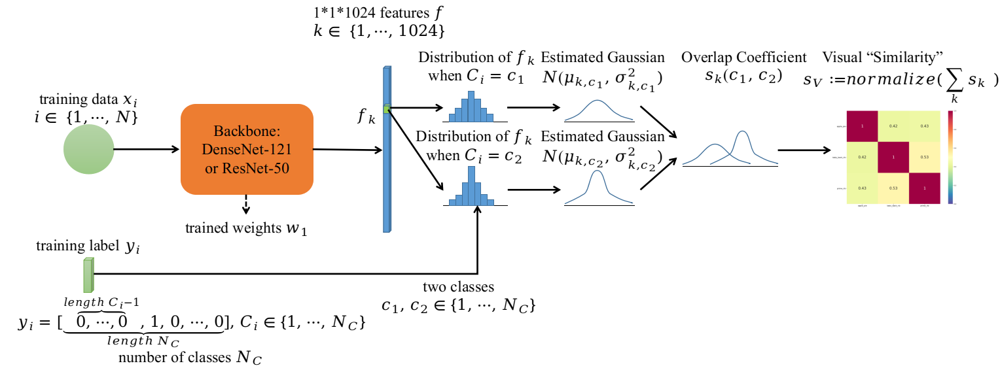
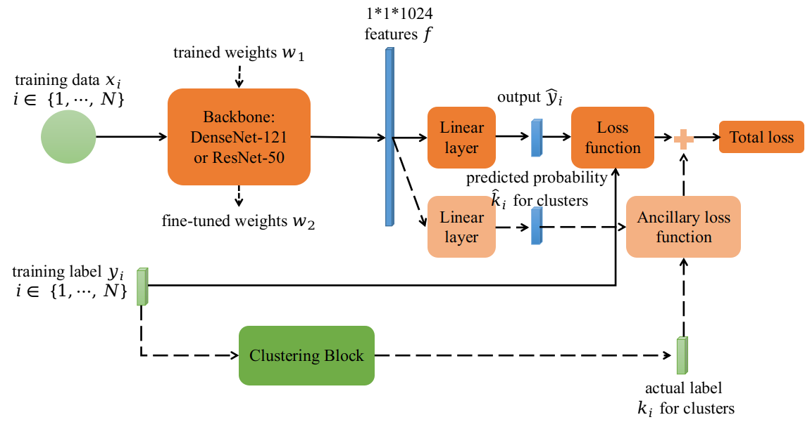
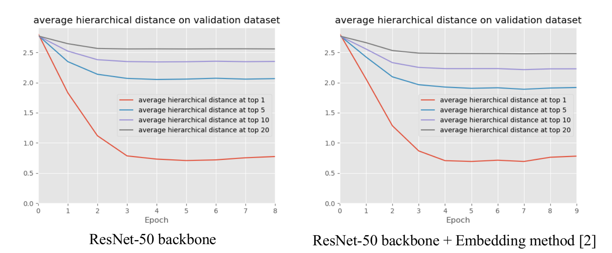
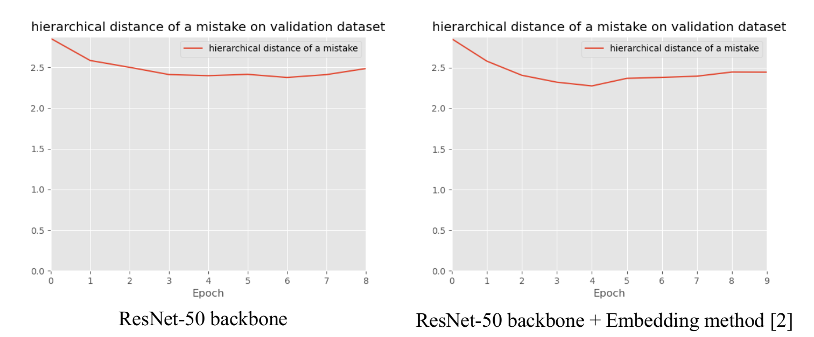

# Hierarchy based classification and embedding
This repository contains our unofficial re-implementation of the hierarchical based classification method from the paper [Visual Aware Hierarchy Based Food Recognition](https://arxiv.org/pdf/2012.03368.pdf). 




We also incoporated the hierarchical based embedding method into our codes to reduce the `average hierarchical distance of top-k` and the `hierarchical distance of a mistake` (see the paper [Hierarchy-Based Image Embeddings for Semantic Image Retrieval](https://arxiv.org/pdf/1809.09924.pdf)).


The left diagrams show the hierarchical distances with ResNet-50 backbone only, while the right diagrams show the hierarchical distances for the hierarchical method with ResNet-50 backbone.

## dependencies
* numpy
* matplotlib
* pyTorch
* [PyTorch Lightning](https://www.pytorchlightning.ai/)
* [PyTorch Lightning Bolts](https://www.pytorchlightning.ai/bolts)

## usage
Firstly, we have to prepare the dataset, such as [VIPER-FoodNet (VFN) Dataset](https://lorenz.ecn.purdue.edu/~vfn/).

Then we can either group the categories into clusters based on visual features and the affinity propagation method, or define the clusters in advance (put the corresponding csv files in the `hierarchy` directory).

The first choice would be the method from [1]. We can reproduce the results with
```bash
source train.sh
```
The second choice is the hierarchical based embedding method [2]. We can complete the training/validation/test procedures with
```bash
source train_embed.sh
```

## references
[1] [R. Mao, et al. “Visual Aware Hierarchy Based Food Recognition,” Proceedings of  the International Conference on Pattern Recognition, 2021](https://arxiv.org/pdf/2012.03368.pdf)

[2] [B. Barz, et al. “Hierarchy-Based Image Embeddings for Semantic Image Retrieval,” WACV, 2019](https://arxiv.org/pdf/1809.09924.pdf)